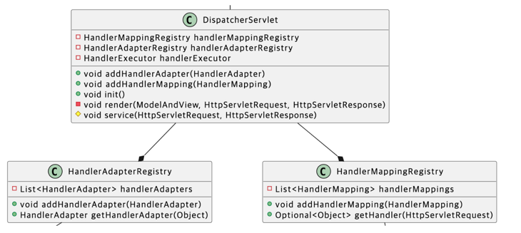

# 🚀 2단계 - 점진적인 리팩터링

## 미션 설명
새로운 MVC 프레임워크를 추가하면 기존에 구현한 컨트롤러 인터페이스 기반 MVC 프레임워크로 만든 컨트롤러도 변경 해야 할까?
실습 코드는 컨트롤러 클래스의 갯수가 적고 시스템 영향도 파악이 어렵지 않고 금방 바꿀 수 있다.
하지만 실제 서비스 되는 프로덕션 코드는 복잡하고 영향 범위가 훨씬 크다.
수백 개에서 수천 개의 클래스를 변경해야 될 수도 있다.
변경이 쉽지 않기 때문에 기존 코드를 유지하면서 신규 기능을 추가해야 한다.

## 기능 요구사항

### Legacy MVC 와 @MVC 통합하기
컨트롤러 인터페이스 기반 MVC 프레임워크와 @MVC 프레임워크가 공존하도록 만들자.
예를 들면, 회원가입 컨트롤러를 아래처럼 어노테이션 기반 컨트롤러로 변경해도 정상 동작해야 한다.
```java
@Controller
public class RegisterController {

    @RequestMapping(value = "/register", method = RequestMethod.POST)
    public ModelAndView save(HttpServletRequest req, HttpServletResponse res) {
        ...
    }

    @RequestMapping(value = "/register", method = RequestMethod.GET)
    public ModelAndView show(HttpServletRequest req, HttpServletResponse res) {
        ...
    }
}
```

## 힌트

### AnnotationHandlerMapping 클래스 다이어그램


### AnnotationHandlerMapping 클래스의 initialize 메서드는 어떤 작업이 필요할까?
### ControllerScanner 클래스를 추가하자
```text
ControllerScanner에게 컨트롤러를 찾아서 인스턴스 생성하는 역할을 맡긴다.
```

1. Reflections 라이브러리를 사용한다.
2. Reflections 객체로 @Controller 가 설정된 모든 클래스를 찾는다.

```java
Reflections reflections = new Reflections("camp.nextstep.controller");
Set<Class<?>> controllers = reflections.getTypesAnnotatedWith(Controller.class);
```

3. 각 클래스의 인스턴스를 생성한다.

```java
final Map<Class<?>, Object> controllers = new HashMap<>();
// 리플랙션 테스트에서 Class로 어떻게 객체를 생성하는지 참고하자
```

### 컨트롤러의 메서드 정보로 HandlerExecution 을 생성한다.
```text
스캔한 컨트롤러 정보를 바탕으로 Map<HandlerKey, HandlerExecution> handlerExecutions을 생성한다.
```

1. 컨트롤러에서 메서드 정보는 어떻게 가져올까?
- @RequestMapping이 붙어있는 메서드 정보를 가져와야 한다.
```java
ReflectionUtils.getAllMethods(class, ReflectionUtils.withAnnotation(RequestMapping.class))
```

2. 가져온 메서드에서 @RequestMapping의 정보를 바탕으로 HandlerKey 객체를 생성한다.
```java
final RequestMapping requestMapping = method.getAnnotation(RequestMapping.class);
```

```java
// RequestMapping으로부터 HandlerKey 객체에 URL과 HTTP method를 저장한다.
new HandlerKey(requestMapping.value(), requestMapping.method())
```

3. HandlerExecution도 생성하자
- HandlerKey에 매핑되는 메서드를 실행하는 역할을 맡긴다.
- HandlerExecution는 실행할 메서드의 인스턴스와 실행할 메서드를 인스턴스 변수로 갖는다.

### DispatcherServlet 클래스 다이어그램


미션 요구사항에 따르면 AnnotationHandlerMapping를 구현하는 동안 ManualHandlerMapping도 유지해야 한다.
어떻게 두 클래스를 통합시킬 것인가?

### HandlerMapping 인터페이스
RequestMapping, AnnotationHandlerMapping은 요청 URL과 실행할 컨트롤러 클래스 또는 메소드를 매핑하는 역할은 같다.
단지 다른 점이라면 RequestMapping은 개발자가 수동으로 등록하고, AnnotationHandlerMapping은 애노테이션을 설정하면 자동으로 매핑한다는 점이다.
두 클래스의 공통된 부분을 인터페이스로 추상화한다.

HandlerMapping 이름으로 인터페이스를 추가한다.
DispatcherServlet의 초기화 과정에서 ManualHandlerMapping, AnnotationHandlerMapping을 모두 초기화한다. 초기화한 2개의 HandlerMapping을 List로 관리한다.

```java
public interface HandlerMapping {
    Object getHandler(HttpServletRequest request);
}
```

### HandlerAdapter 인터페이스
AnnotationHandlerMapping 또는 ManualHandlerMapping 클래스에서 찾은 컨트롤러를 실행해야 한다.
요청 URL에 따라 AnnotationHandlerMapping은 HandlerExecution을 반환하고 ManualHandlerMapping는 Controller를 반환한다. 그리고 둘다 메서드를 실행한다.

```java
Object handler = getHandler(req);
if (handler instanceof Controller) {
    ModelAndView mav = ((Controller)handler).execute(req, resp);
} else if (handler instanceof HandlerExecution) {
    ModelAndView mav = ((HandlerExecution)handler).handle(req, resp);
} else {
    // throw exception
}
```

---

## 요구사항 정리

[x] ControllerScanner 클래스를 추가한다
[x] controllers 를 일급컬렉션으로 만들어서 관리한다
[ ] HandlerMapping 공통 인터페이스를 만들어서 RequestMapping, AnnotationHandlerMapping 을 관리한다
    [ ] 초기화 메서드에서 2개의 HandlerMapping 을 리스트로 관리한다
    [ ] HandlerMappingRegistry 를 추가한다.
[ ] HandlerAdapter 인터페이스를 추가한다
    [ ] HandlerAdapterRegistry 를 추가한다
    [ ] 요청 URL 에 따라 AnnotationHandlerMapping 은 HAndlerExecution, ManualHandlerMapping 은 Controller 를 반환하고 메서드를 실행하도록 구현한다
